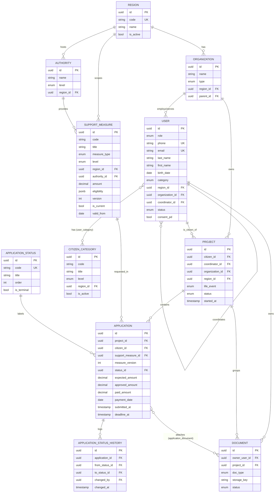

# КУРАТОР — Модель данных MVP

**Документ:** MVP_Data_Model_v1.md
**Версия:** 1.1
**Дата:** 2026-07-06
**Статус:** Принято PM (v1.0) + внесены правки по итогам приёмки (v1.1)

> **Changelog v1.1** (по замечаниям PM после приёмки T-001):
> - `CitizenCategory` вынесена в отдельный справочник со связью **N:M** (гражданин может
>   иметь несколько категорий), вместо inline-ENUM `user.category`.
> - Поля выплат в `application` переименованы: `expected_amount`, `approved_amount`,
>   `paid_amount`, `payment_date` (отдельная сущность Payment — в v2.x).
> - Уточнено: `Project` = кейс по одной жизненной ситуации; у гражданина со временем
>   может быть много проектов (снято ограничение «один активный на гражданина»).
**Уровень:** Product + Solution Architecture — источник истины для генерации БД, API и сервисов
**Задача:** T-001

---

## 0. Назначение и границы

Документ описывает единую модель данных ядра платформы «КУРАТОР» на этапе MVP. Это
архитектурный источник истины: из него далее генерируются схема БД, API-контракты и
сервисы. Код и SQL здесь сознательно отсутствуют.

Модель обязана без изменения структуры поддерживать шесть базовых сценариев MVP:

1. Регистрация пользователя.
2. Создание организации.
3. Создание проекта (кейса сопровождения).
4. Загрузка мер поддержки (например, Краснодарского края).
5. Подбор мер поддержки по параметрам проекта.
6. Создание заявки на получение меры поддержки.

### Соглашения

- Идентификаторы — `UUID v4`, генерируются системой, неизменяемы.
- Временные метки — `TIMESTAMP` в UTC (ISO 8601), поля `created_at` / `updated_at`
  присутствуют во всех сущностях (в таблицах ниже не дублируются для краткости).
- Мягкое удаление — поле `is_deleted BOOLEAN` + `deleted_at`, физически данные не стираются
  (требование аудита и 152-ФЗ ст.21 реализуется отдельной операцией стирания).
- Денежные суммы — `DECIMAL(14,2)`, отдельное поле валюты не вводим (MVP — только RUB).
- Перечислимые значения (`ENUM`) фиксируются в этом документе как справочники.

---

## 1. Перечень сущностей MVP

| # | Сущность | Тех. имя | Назначение |
|---|----------|----------|------------|
| 1 | Пользователь | `user` | Человек в системе: гражданин, координатор или руководитель |
| 2 | Организация | `organization` | Региональный фонд / ведомство — владелец данных и координаторов |
| 3 | Проект | `project` | Персональный кейс сопровождения гражданина (аналог Journey MVP) |
| 4 | Мера поддержки | `support_measure` | Льгота/выплата/услуга, которую можно получить |
| 5 | Регион | `region` | Субъект РФ — территориальная привязка мер и организаций |
| 6 | Орган власти | `authority` | Ведомство, предоставляющее меру (СФР, МО, соцзащита и т.д.) |
| 7 | Документ | `document` | Файл гражданина (справка, удостоверение, заявление) |
| 8 | Заявка | `application` | Обращение гражданина за конкретной мерой поддержки |
| 9 | Статус заявки | `application_status` | Справочник состояний жизненного цикла заявки |
| 10 | Категория гражданина | `citizen_category` | Справочник категорий (СВО, инвалид, многодетный…), N:M с гражданином |

---

## 2. Описание сущностей

Обозначения обязательности: **О** — обязательное, **Н** — необязательное (nullable).

### 2.1 Пользователь (`user`)

**Назначение:** учётная запись человека. Роль определяет права (RBAC). Гражданин, координатор
и руководитель — это один тип сущности с разным `role`, что упрощает аутентификацию и
масштабирование.

| Поле | Тип | Об. | Пример | Примечание |
|------|-----|-----|--------|------------|
| `id` | UUID | О | `9f1c…` | PK, неизменяем |
| `role` | ENUM(user_role) | О | `citizen` | citizen / coordinator / manager / admin |
| `phone` | STRING(20) | О | `+79180000000` | Уникален, основной логин |
| `email` | STRING(255) | Н | `a@ex.ru` | Уникален если задан |
| `last_name` | STRING(100) | О | `Даштоян` | |
| `first_name` | STRING(100) | О | `Артур` | |
| `middle_name` | STRING(100) | Н | `—` | |
| `birth_date` | DATE | Н | `1990-05-01` | Для подбора мер по возрасту |
| `region_id` | UUID | Н | → region | Регион проживания |
| `organization_id` | UUID | Н | → organization | Для координаторов/руководителей |
| `coordinator_id` | UUID | Н | → user | Закреплённый координатор (для граждан) |
| `status` | ENUM(user_status) | О | `active` | active / invited / blocked |
| `consent_pd` | BOOLEAN | О | `true` | Согласие на обработку ПДн (152-ФЗ) |

**Идентификаторы:** PK `id`; естественные уникальные ключи — `phone`, `email`.

**Справочники:**
- `user_role`: `citizen`, `coordinator`, `manager`, `admin`.
- `user_status`: `invited`, `active`, `blocked`.

> Категории гражданина вынесены в отдельную сущность `citizen_category` (§2.10) со связью
> N:M — у гражданина может быть несколько категорий одновременно.

### 2.2 Организация (`organization`)

**Назначение:** региональный фонд, ведомство или подразделение. Владеет координаторами,
гражданами и настройками White Label.

| Поле | Тип | Об. | Пример | Примечание |
|------|-----|-----|--------|------------|
| `id` | UUID | О | `2a…` | PK |
| `name` | STRING(255) | О | `Фонд «Защитники Отечества» КК` | |
| `type` | ENUM(org_type) | О | `regional_fund` | regional_fund / ministry / mfc / partner |
| `region_id` | UUID | О | → region | |
| `parent_id` | UUID | Н | → organization | Иерархия (федеральный → региональный) |
| `inn` | STRING(12) | Н | `2300000000` | Для юр. идентификации |
| `is_active` | BOOLEAN | О | `true` | |

**Идентификаторы:** PK `id`; уникален `inn` (если задан) в паре с `region_id`.

**Справочник `org_type`:** `federal_fund`, `regional_fund`, `ministry`, `mfc`, `partner`.

### 2.3 Проект (`project`)

**Назначение:** персональный кейс сопровождения гражданина — контейнер, объединяющий гражданина,
его меры, заявки и документы в рамках одного жизненного события. Реализует «один активный
Journey на гражданина» из архитектуры.

| Поле | Тип | Об. | Пример | Примечание |
|------|-----|-----|--------|------------|
| `id` | UUID | О | `7c…` | PK |
| `citizen_id` | UUID | О | → user | Гражданин, чей это кейс |
| `coordinator_id` | UUID | Н | → user | Ответственный координатор |
| `organization_id` | UUID | О | → organization | Владелец кейса |
| `region_id` | UUID | О | → region | Регион сопровождения |
| `title` | STRING(255) | О | `Сопровождение семьи` | |
| `life_event` | ENUM(life_event) | О | `svo_injury` | Триггер-событие кейса |
| `status` | ENUM(project_status) | О | `active` | active / paused / completed |
| `started_at` | TIMESTAMP | О | `2026-07-06…` | |
| `closed_at` | TIMESTAMP | Н | `—` | |

**Идентификаторы:** PK `id`. Бизнес-правило (не структурное): один `active` проект на
`citizen_id` — контролируется частичным уникальным индексом (см. §6).

**Справочники:**
- `life_event`: `svo_injury`, `svo_death`, `svo_return`, `disability`, `childbirth`, `other`.
- `project_status`: `active`, `paused`, `completed`, `cancelled`.

### 2.4 Мера поддержки (`support_measure`)

**Назначение:** карточка льготы/выплаты/услуги. Главный контентный актив — редактируется без
кода, версионируется. Именно сюда загружается таблица льгот Краснодарского края.

| Поле | Тип | Об. | Пример | Примечание |
|------|-----|-----|--------|------------|
| `id` | UUID | О | `b3…` | PK, стабилен между версиями |
| `code` | STRING(64) | О | `KK-SVO-PAY-001` | Человекочитаемый бизнес-код |
| `title` | STRING(500) | О | `Единовременная выплата участнику СВО` | |
| `description` | TEXT | Н | `…` | |
| `measure_type` | ENUM(measure_type) | О | `payment` | payment / benefit / service / compensation |
| `level` | ENUM(measure_level) | О | `regional` | federal / regional / municipal |
| `region_id` | UUID | Н | → region | NULL = федеральная (все регионы) |
| `authority_id` | UUID | О | → authority | Кто предоставляет |
| `amount` | DECIMAL(14,2) | Н | `100000.00` | Для выплат |
| `eligibility` | JSONB | О | `{...}` | Критерии подбора (см. ниже) |
| `required_documents` | JSONB | Н | `["mil_id"]` | Коды нужных документов |
| `application_channel` | ENUM(channel) | Н | `gosuslugi` | Куда подавать |
| `valid_from` | DATE | О | `2026-01-01` | Дата вступления в силу |
| `valid_to` | DATE | Н | `—` | NULL = бессрочно |
| `version` | INT | О | `1` | Номер версии карточки |
| `is_current` | BOOLEAN | О | `true` | Актуальная версия |
| `source_url` | STRING(1000) | Н | `—` | Ссылка на НПА |

**Поле `eligibility` (JSONB)** — набор условий подбора, интерпретируемых Rule Engine.
Пример структуры:

```
{
  "all": [
    { "field": "category", "op": "in", "value": ["svo_participant"] },
    { "field": "region_id", "op": "eq", "value": "<region_uuid>" },
    { "field": "age", "op": "gte", "value": 18 }
  ]
}
```

**Идентификаторы:** PK `id`; бизнес-ключ версии — пара (`code`, `version`) уникальна.
Логический ключ «действующая мера» — (`code`, `is_current=true`).

**Справочники:**
- `measure_type`: `payment`, `benefit`, `service`, `compensation`.
- `measure_level`: `federal`, `regional`, `municipal`.
- `channel`: `gosuslugi`, `mfc`, `sfr`, `org_office`, `online`.

### 2.5 Регион (`region`)

**Назначение:** справочник субъектов РФ. Территориальная привязка мер, организаций, граждан.
Основа White Label (85 регионов).

| Поле | Тип | Об. | Пример | Примечание |
|------|-----|-----|--------|------------|
| `id` | UUID | О | `d1…` | PK |
| `code` | STRING(10) | О | `23` | Код субъекта РФ (ОКАТО/ISO) |
| `name` | STRING(255) | О | `Краснодарский край` | |
| `is_active` | BOOLEAN | О | `true` | Развёрнут ли White Label |

**Идентификаторы:** PK `id`; уникален `code`.

### 2.6 Орган власти (`authority`)

**Назначение:** ведомство-поставщик меры (СФР, Минобороны, соцзащита, МФЦ).

| Поле | Тип | Об. | Пример | Примечание |
|------|-----|-----|--------|------------|
| `id` | UUID | О | `e2…` | PK |
| `name` | STRING(255) | О | `Соцзащита Краснодарского края` | |
| `level` | ENUM(measure_level) | О | `regional` | federal / regional / municipal |
| `region_id` | UUID | Н | → region | NULL = федеральный орган |
| `contact` | JSONB | Н | `{...}` | Телефон, адрес, сайт |

**Идентификаторы:** PK `id`.

### 2.7 Документ (`document`)

**Назначение:** файл гражданина, привязанный к проекту и/или заявке. Хранение зашифрованное.

| Поле | Тип | Об. | Пример | Примечание |
|------|-----|-----|--------|------------|
| `id` | UUID | О | `f4…` | PK |
| `owner_user_id` | UUID | О | → user | Владелец (гражданин) |
| `project_id` | UUID | Н | → project | Контекст |
| `doc_type` | ENUM(doc_type) | О | `mil_id` | Код типа документа |
| `title` | STRING(255) | О | `Военный билет` | |
| `storage_key` | STRING(500) | О | `s3://…` | Путь в зашифрованном хранилище |
| `mime_type` | STRING(100) | О | `application/pdf` | |
| `size_bytes` | BIGINT | О | `284512` | |
| `status` | ENUM(doc_status) | О | `uploaded` | uploaded / verified / rejected |
| `verified_by` | UUID | Н | → user | Координатор-проверяющий |

**Идентификаторы:** PK `id`.

**Справочники:**
- `doc_type`: `passport`, `mil_id`, `injury_cert`, `death_cert`, `disability_cert`,
  `birth_cert`, `application_form`, `other`.
- `doc_status`: `uploaded`, `verified`, `rejected`.

### 2.8 Заявка (`application`)

**Назначение:** обращение гражданина за конкретной мерой поддержки в рамках проекта.
Ключевой транзакционный объект.

| Поле | Тип | Об. | Пример | Примечание |
|------|-----|-----|--------|------------|
| `id` | UUID | О | `1b…` | PK |
| `project_id` | UUID | О | → project | |
| `citizen_id` | UUID | О | → user | Денормализация для скорости выборок |
| `support_measure_id` | UUID | О | → support_measure | На какую меру |
| `measure_version` | INT | О | `1` | Версия меры на момент подачи (фиксируется) |
| `coordinator_id` | UUID | Н | → user | Кто ведёт |
| `status_id` | UUID | О | → application_status | Текущий статус |
| `channel` | ENUM(channel) | Н | `mfc` | Куда подана |
| `expected_amount` | DECIMAL(14,2) | Н | `100000.00` | Ожидаемая сумма |
| `approved_amount` | DECIMAL(14,2) | Н | `—` | Одобренная сумма |
| `paid_amount` | DECIMAL(14,2) | Н | `—` | Фактически выплачено |
| `payment_date` | DATE | Н | `—` | Дата выплаты |
| `submitted_at` | TIMESTAMP | Н | `—` | |
| `decided_at` | TIMESTAMP | Н | `—` | |
| `deadline_at` | TIMESTAMP | Н | `—` | Дедлайн действия |
| `note` | TEXT | Н | `—` | |

**Идентификаторы:** PK `id`.

### 2.9 Статус заявки (`application_status`)

**Назначение:** справочник состояний жизненного цикла заявки. Вынесен в отдельную сущность
(а не ENUM), чтобы регионы могли расширять статусы через White Label без изменения кода.

| Поле | Тип | Об. | Пример | Примечание |
|------|-----|-----|--------|------------|
| `id` | UUID | О | `3c…` | PK |
| `code` | STRING(50) | О | `submitted` | Стабильный код |
| `title` | STRING(255) | О | `Подана` | Отображаемое имя |
| `order` | INT | О | `20` | Порядок в жизненном цикле |
| `is_terminal` | BOOLEAN | О | `false` | Конечное ли состояние |

**Базовый набор кодов:** `draft` (10), `submitted` (20), `in_review` (30),
`need_docs` (40), `approved` (50), `paid` (60), `rejected` (90, terminal),
`cancelled` (95, terminal).

**История переходов** ведётся в связочной сущности `application_status_history` (см. §4 и §5).

### 2.10 Категория гражданина (`citizen_category`)

**Назначение:** редактируемый справочник категорий граждан (СВО, инвалид, многодетный и т.д.).
Вынесен из ENUM, чтобы регионы и федеральный уровень добавляли новые категории через White
Label без изменения кода. Связь с гражданином — N:M (у гражданина может быть несколько категорий).

| Поле | Тип | Об. | Пример | Примечание |
|------|-----|-----|--------|------------|
| `id` | UUID | О | `5e…` | PK |
| `code` | STRING(64) | О | `svo_participant` | Стабильный код для правил подбора |
| `title` | STRING(255) | О | `Участник СВО` | Отображаемое имя |
| `level` | ENUM(measure_level) | О | `federal` | federal / regional / municipal |
| `region_id` | UUID | Н | → region | NULL = федеральная категория |
| `is_active` | BOOLEAN | О | `true` | |

**Идентификаторы:** PK `id`; уникален `code` в паре с `region_id`.

**Базовый набор кодов:** `svo_participant`, `svo_family`, `svo_deceased_family`, `veteran`,
`disabled`, `large_family`, `low_income`, `other` (регион дополняет своими).

**Связочная сущность `user_category`** (реализует N:M): `id`, `user_id` → user,
`citizen_category_id` → citizen_category, `assigned_at`, `assigned_by` → user (кто присвоил),
`confirmed` BOOLEAN (подтверждена ли документально). Уникальна пара (`user_id`,
`citizen_category_id`).

---

## 3. Матрица связей (обзор)

| От | К | Тип | Смысл |
|----|----|-----|-------|
| Организация | Пользователь | 1:N | В организации много сотрудников/граждан |
| Пользователь(coordinator) | Пользователь(citizen) | 1:N | Координатор ведёт многих граждан |
| Регион | Организация | 1:N | В регионе много организаций |
| Регион | Мера поддержки | 1:N | У региона свои меры (federal — NULL) |
| Орган власти | Мера поддержки | 1:N | Ведомство предоставляет много мер |
| Пользователь(citizen) | Проект | 1:N | У гражданина много кейсов (по жизненным ситуациям) |
| Пользователь(citizen) | Категория гражданина | N:M | Через `user_category` — у гражданина несколько категорий |
| Проект | Заявка | 1:N | В проекте много заявок |
| Проект | Документ | 1:N | В проекте много документов |
| Мера поддержки | Заявка | 1:N | На меру подают много заявок |
| Статус заявки | Заявка | 1:N | Статус у многих заявок |
| Заявка | Документ | N:M | Через `application_document` |
| Мера поддержки | Документ (типы) | N:M | Через `required_documents` (JSONB, справочные коды) |

---

## 4. Детализация связей

**1:1** — в MVP выделенных 1:1 связей нет. Профильные атрибуты гражданина хранятся прямо в
`user`, чтобы не плодить джойны. (Кандидат на вынос 1:1 в v2 — `citizen_profile` при росте
числа категорий.)

**1:N (главные):**
- `organization` → `user`: сотрудники и подопечные организации. FK `user.organization_id`.
- `user(coordinator)` → `user(citizen)`: закрепление. FK `user.coordinator_id` (self-reference).
- `region` → `organization`, `region` → `support_measure`, `region` → `authority`.
- `authority` → `support_measure`: FK `support_measure.authority_id`.
- `user(citizen)` → `project`: FK `project.citizen_id`.
- `project` → `application`, `project` → `document`.
- `support_measure` → `application`: FK `application.support_measure_id` (+ `measure_version`).
- `application_status` → `application`: FK `application.status_id`.

**N:M (через связочные таблицы):**
- `user` ↔ `citizen_category` — таблица `user_category` (`user_id`, `citizen_category_id`,
  `assigned_by`, `confirmed`). Гражданин относится к нескольким категориям; категория
  охватывает многих граждан. Основной вход для подбора мер в Rule Engine.
- `application` ↔ `document` — таблица `application_document` (`application_id`, `document_id`,
  `role` — например `attachment` / `result`). Одна заявка использует много документов; один
  документ прикладывается к нескольким заявкам.
- `support_measure` ↔ типы документов — реализовано полем `required_documents` (JSONB со
  справочными кодами `doc_type`), т.к. это справочная связь, а не связь конкретных записей.

**Историческая (служебная):**
- `application_status_history` (`id`, `application_id`, `from_status_id`, `to_status_id`,
  `changed_by`, `changed_at`, `comment`) — неизменяемый журнал переходов (Event Sourcing lite).

---

## 5. ER-диаграмма (Mermaid)



---

## 6. Предложения по индексам БД

| Сущность | Индекс | Тип | Обоснование |
|----------|--------|-----|-------------|
| user | `phone` | UNIQUE | Логин, поиск по телефону |
| user | `email` | UNIQUE (partial, NOT NULL) | Альтернативный логин |
| user | `coordinator_id` | B-tree | Выборка «мои подопечные» координатором |
| user | `organization_id, role` | composite | Списки сотрудников/граждан организации |
| user | `region_id, category` | composite | Подбор мер и сегментация |
| project | `citizen_id, status` | composite | Кейсы гражданина (их может быть много) |
| project | `citizen_id, life_event` WHERE status='active' | UNIQUE partial | Не дублировать активный кейс по одной жизненной ситуации |
| project | `coordinator_id, status` | composite | Рабочий стол координатора |
| support_measure | `code, version` | UNIQUE | Версионирование карточки |
| support_measure | `code` WHERE is_current | UNIQUE partial | Быстрый доступ к действующей мере |
| support_measure | `region_id, measure_type, is_current` | composite | Подбор мер по региону/типу |
| support_measure | `eligibility` | GIN (JSONB) | Подбор по критериям Rule Engine |
| support_measure | `valid_from, valid_to` | B-tree | Отбор действующих на дату |
| application | `project_id` | B-tree | Заявки проекта |
| application | `citizen_id, status_id` | composite | Заявки гражданина по статусу |
| application | `support_measure_id` | B-tree | Аналитика по мере |
| application | `deadline_at` WHERE not terminal | partial | Эскалация просроченных |
| document | `owner_user_id` | B-tree | Документы гражданина |
| document | `project_id` | B-tree | Документы кейса |
| app_status_history | `application_id, changed_at` | composite | История переходов заявки |
| region | `code` | UNIQUE | Справочный доступ |
| citizen_category | `code, region_id` | UNIQUE | Стабильный код категории |
| user_category | `user_id, citizen_category_id` | UNIQUE | Одна категория на гражданина без дублей |
| user_category | `citizen_category_id` | B-tree | Обратный подбор граждан по категории |

---

## 7. Правила версионирования

**Неизменяемые поля (после создания):** все `id` (PK), `user.phone` (смена — через
верификацию как отдельная операция), `application.measure_version` и `support_measure_id`
в заявке (фиксируют, на какую именно версию меры подавались), `created_at`.

**Изменяемые поля:** контактные и профильные данные пользователя, статусы, суммы факта,
контент организации/региона/органа власти. Изменения фиксируются через `updated_at` и
(для критичных сущностей) через audit log.

**Версионирование мер поддержки (ключевой механизм):**

- Мера идентифицируется стабильным `code`. Каждое изменение сути (сумма, критерии, документы,
  срок действия) НЕ правит запись, а создаёт **новую строку** с тем же `code`, `version+1`,
  новым `id`, `valid_from` = дата изменения.
- У предыдущей версии `is_current=false` и проставляется `valid_to`.
- Действующая мера — строка с `is_current=true` (гарантируется partial unique индексом).
- Заявка навсегда помнит `support_measure_id` + `measure_version`, на которые подавалась, —
  историческая корректность сохраняется даже после изменения меры.
- Полная история мер доступна выборкой по `code` с сортировкой по `version`.

**История заявок:** переходы статусов не перезаписываются в `application.status_id` «молча» —
каждый переход дополнительно пишется неизменяемой строкой в `application_status_history`.

---

## 8. Проверка покрытия сценариев MVP

| Сценарий | Как покрыт моделью |
|----------|--------------------|
| Регистрация пользователя | `user` (role=citizen, phone, consent_pd) |
| Создание организации | `organization` + `region_id` |
| Создание проекта | `project` (citizen_id, organization_id, life_event) |
| Загрузка мер (Краснодарский край) | `support_measure` с `region.code=23`, `authority`, `eligibility` |
| Подбор мер по параметрам проекта | Индекс по `region_id/measure_type/is_current` + GIN по `eligibility`, матчинг профиля `user`/`project` |
| Создание заявки на меру | `application` (project_id, support_measure_id, measure_version, status) |

Структура покрывает все шесть сценариев без изменения схемы.

---

## 9. Допущения MVP (что сознательно НЕ входит)

- **Rule Engine как движок** — в модели есть контейнер условий (`eligibility` JSONB), но сам
  движок вычисления правил, приоритезация (федеральное перекрывается региональным), A/B —
  вне модели данных, это отдельный компонент.
- **Journey/Stage/Step** — маршрут сопровождения не раскрыт до шагов; `project` — упрощённый
  контейнер. Полный граф этапов — цель следующей итерации.
- **Payment как отдельная сущность** — факт выплаты в MVP хранится полем `amount_received` в
  заявке, отдельной сущности «платёж» с реестром транзакций нет.
- **Семейный доступ (Family)** — совместный доступ родственников к кейсу отложен.
- **Интеграции с госсистемами** (Госуслуги/СФР/МО) — только справочные поля `channel`,
  `source_url`; реальные API-интеграции — год 2–3 (аккредитация).
- **Мультиязычность и мультивалютность** — только RU/RUB.
- **Полный audit log и Event Sourcing** — заложен только журнал статусов заявки; сквозной
  event sourcing по всем сущностям — позже.
- **Уведомления, дедлайны-эскалации** — поля-зацепки (`deadline_at`) есть, логика — в сервисах.

---

## 10. Вопросы к PM — решения приняты (v1.1)

1. **«Проект» = кейс по одной жизненной ситуации.** У гражданина со временем много проектов
   (соцвыплата, субсидия, грант, жильё). ✅ Учтено: снят «один активный на гражданина»,
   оставлено ограничение на дубль активного кейса по одной `life_event`.
2. **Payment-реестр в MVP не нужен.** ✅ Достаточно полей заявки: `expected_amount`,
   `approved_amount`, `paid_amount`, `payment_date`. Отдельная сущность Payment — v2.x
   (транши, казначейство, возвраты, отмены, фин.отчётность).
3. **Категории гражданина — редактируемый справочник, не ENUM.** ✅ Введены `citizen_category`
   + N:M `user_category`.
4. **Связь «мера ↔ документ» — N:M `application_document` достаточно.** ✅ На будущее заложен
   ориентир на `DocumentTemplate` (чек-лист документов) — вне MVP.
