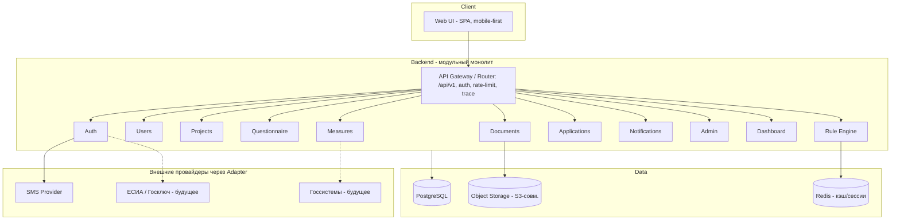

# КУРАТОР — Техническая архитектура сервисов MVP

**Документ:** MVP_Solution_Architecture_v1.md
**Версия:** 1.0
**Дата:** 2026-07-06
**Статус:** Draft на приёмку (PM)
**Уровень:** Solution Architecture — основа для разработки Backend, Frontend и DevOps
**Задача:** T-007
**Зависит от:** все документы MVP (Data Model, Rule Engine, User Flows, API Contracts, UI Spec, Product Backlog)

---

## 0. Назначение и ключевое ограничение

Документ определяет техническую архитектуру системы: ответственность модулей, их
взаимодействие и инфраструктуру.

**Ключевое решение (по вводным основателя):** команда — **2 человека**, цель — быстро собрать
**демонстрируемый прототип** для заказчика (сквозной сценарий «вход → анкета → подбор →
объяснение → заявка»). Поэтому на старте выбран **модульный монолит**, а НЕ микросервисы:
меньше инфраструктурных издержек, один деплой, быстрая разработка. При этом модули имеют
**чистые границы** (отдельные пакеты, общение через сервисные интерфейсы, не через таблицы друг
друга), чтобы позже безболезненно выделить любой модуль в отдельный сервис.

---

## 1. Общая архитектура (логическая схема)

Все модули живут в одном процессе/деплое (монолит), но изолированы как пакеты. Асинхронные
события внутри — через внутреннюю шину (in-process event bus), с возможностью замены на
Kafka/RabbitMQ при выделении сервисов.

---

## 2. Стиль и технологические принципы

- **Модульный монолит**, слоистая структура каждого модуля: `api → service → repository`.
- **Единый API Gateway-слой** (роутер): версия `/api/v1`, аутентификация, rate-limit,
  `X-Trace-Id`, единый формат ошибок (из API Contracts).
- **Взаимодействие модулей** — только через публичные сервисные интерфейсы, без прямого
  доступа к чужим таблицам. Это ключ к будущему распилу на сервисы.
- **События** — in-process event bus (контракт из API Contracts §6): `project.created`,
  `matching.completed`, `application.status_changed` и т.д. Слушатели (уведомления, аудит)
  подписываются, не завися от источника.
- **Стек (рекомендация, не жёсткое требование):** Backend — Python (FastAPI) или Node
  (NestJS); БД — PostgreSQL; кэш — Redis; Frontend — React (SPA, mobile-first); всё
  контейнеризовано (Docker). Выбор — за командой, важна поддержка JSONB и зрелая экосистема.
- **Разработка от демо:** сначала вертикальный срез сквозного сценария (см. §0), затем
  наращивание модулей вширь.

---

## 3. Модули Backend

Для каждого: ответственность · основные сущности · API (из API Contracts) · публикуемые
события · зависимости.

| Модуль | Ответственность | Сущности | API | События (публикует) | Зависит от |
|--------|-----------------|----------|-----|---------------------|------------|
| **Auth** | Вход по SMS, JWT, refresh, 2FA | (session, otp_request) | `/auth/*` | — | Users, SMS-adapter |
| **Users** | Профиль, роли, категории гражданина | user, user_category | `/users/*` | — | Measures (справочник категорий) |
| **Projects** | Кейсы сопровождения | project | `/projects` | project.created | Users |
| **Questionnaire** | Схема анкеты, сбор ответов, контекст | (answers, schema) | `/projects/{id}/questionnaire` | questionnaire.updated | Projects |
| **Rule Engine** | Подбор мер, Score, Explainability, журнал | RuleEvaluationLog | `/projects/{id}/matching/*` | matching.completed | Questionnaire, Measures |
| **Measures** | Меры поддержки, версии, импорт, справочники | support_measure, region, authority, citizen_category, application_status | `/measures/*`, `/dictionaries/*` | measure.published | — |
| **Documents** | Загрузка, хранение, проверка | document, application_document | `/documents/*` | — | Object Storage, Projects |
| **Applications** | Заявки, статусы, история | application, application_status_history | `/applications/*` | application.created, application.status_changed | Projects, Measures, Documents |
| **Notifications** | Внутрисистемные + SMS критичного | notification | `/notifications/*` | — | event bus, SMS-adapter |
| **Admin** | Управление мерами/справочниками, журнал RE | — | `/measures/*`, `/dictionaries/*`, `/matching/log` | — | Measures, Rule Engine |
| **Dashboard** | Агрегаты и метрики | — (read-модели) | `/dashboard/*` | — | Applications, Projects |

Rule Engine изолирован особенно строго: принимает Evaluation Context и набор мер, возвращает
результат — это упрощает будущую замену JSON-интерпретатора на полноценный движок.

---

## 4. Хранилища

| Хранилище | Назначение | Примечания |
|-----------|-----------|------------|
| **PostgreSQL** | Основные данные (все сущности из Data Model) | JSONB для `eligibility`; GIN-индексы; серверы в РФ (152-ФЗ) |
| **Object Storage (S3-совм.)** | Файлы документов | Шифрование объектов; доступ по presigned-URL; Documents-модуль скрывает реализацию за интерфейсом StorageAdapter |
| **Redis** | Кэш подбора, сессии/refresh, rate-limit | Кэш результатов Rule Engine по версии профиля; TTL |

На старте (демо) допустимо: PostgreSQL + локально-совместимое объектное хранилище (MinIO).
Redis можно ввести после демо, если производительность подбора это потребует.

---

## 5. Провайдеры и адаптеры (паттерн Adapter)

Все внешние зависимости скрыты за интерфейсами, чтобы замена провайдера не влияла на ядро:

| Адаптер | Интерфейс | MVP-реализация | Будущее |
|---------|-----------|----------------|---------|
| `AuthProvider` | request_code / verify | SMS-провайдер | ЕСИА, Госключ, корпоративный SSO |
| `StorageAdapter` | put / get / signed_url | MinIO / S3 | Гос-облако |
| `MeasureImportAdapter` | parse / map | Импорт таблицы (Excel/CSV Краснодарского края) | API госсистем (СФР/МО) — год 2–3 |
| `NotificationChannel` | send | In-app; SMS для критичного | Push (мобильное приложение) |

Ядро (Rule Engine, Journey, модель данных) не знает о конкретных провайдерах — только об
интерфейсах. Это же обеспечивает White Label и постепенное подключение госинтеграций.

---

## 6. Безопасность (152-ФЗ как архитектурная цель)

- **Аутентификация:** JWT (access+refresh), 2FA обязательна для ролей `coordinator`+.
- **Авторизация:** RBAC — `citizen / coordinator / admin`; проверки на уровне ресурса
  (координатор видит только своих подопечных).
- **Аудит:** неизменяемый audit log всех действий с данными гражданина; журнал Rule Engine.
- **Защита ПДн:** данные и файлы хранятся в РФ; шифрование в покое (AES-256) и транзите
  (TLS 1.3); документы шифруются с персональным ключом; право на удаление (ст.21 152-ФЗ).
- **Управление секретами:** секреты (ключи, токены провайдеров) — в secret-хранилище
  (env/Vault), не в коде и не в репозитории.
- **Приватность:** нет рекламы, нет продажи данных; гражданин видит, кто обращался к его
  данным; семейный доступ — только с согласия (задел на будущее).

---

## 7. Нефункциональные требования

| Показатель | Цель | Как достигается |
|------------|------|-----------------|
| Время подбора | ≤ 3 сек | Дешёвая фильтрация по индексам → дорогая проверка; кэш Redis |
| API latency | p95 ≤ 500 мс (кроме Rule Engine) | Индексы, пагинация, отсутствие N+1 |
| Масштабируемость | Горизонтальная после демо | Stateless-модули за балансировщиком; выделение модулей в сервисы при росте |
| Резервное копирование | Ежедневные бэкапы PG + документов | Автоматизированные снапшоты, тест восстановления |
| Мониторинг | Метрики, алерты | Health-checks, метрики (Prometheus/аналог), алерты на p95/ошибки |
| Логирование | Централизованное, с trace_id | Структурные логи, сквозной `X-Trace-Id` из API Contracts |
| Доступность (пилот) | API ≥ 99% | Простая, но надёжная инфраструктура; минимум точек отказа на старте |

---

## 8. Стратегия эволюции (монолит → сервисы)

1. **Демо/пилот:** модульный монолит, один деплой, MinIO+Postgres. Цель — сквозной сценарий.
2. **Рост нагрузки:** выносим первым Rule Engine (самый ресурсоёмкий и изолированный) в
   отдельный сервис; in-process шина → брокер (Kafka/RabbitMQ).
3. **Масштаб/White Label по регионам:** мультитенантность, вынос Documents и Notifications,
   гос-интеграции через адаптеры.

Границы модулей (§3) выбраны так, что каждый шаг не требует переписывания ядра — только
замену внутренней шины и деплой-конфигурации.

---

## 9. Проверка критерия готовности (T-007)

| Требование PM | Где выполнено |
|---------------|---------------|
| Логическая схема системы | §1 (Mermaid) |
| Модули: ответственность/сущности/API/события/зависимости | §3 (таблица) |
| Хранилища | §4 |
| Адаптеры провайдеров (Adapter) | §5 |
| Безопасность 152-ФЗ | §6 |
| Нефункциональные требования | §7 |

---

## 10. Вопросы к PM

1. Подтверждаем модульный монолит для старта (вместо микросервисов) — с учётом команды из
   2 человек и цели «быстрое демо»?
2. Стек оставляем на выбор команды (FastAPI/NestJS + React + PostgreSQL) или зафиксировать
   конкретный сейчас?
3. Для демо достаточно MinIO+Postgres без Redis, вводя Redis только при необходимости?
4. Следующий шаг — план сборки демо-прототипа (вертикальный срез сквозного сценария) и
   инициализация репозитория/скелета кода?
