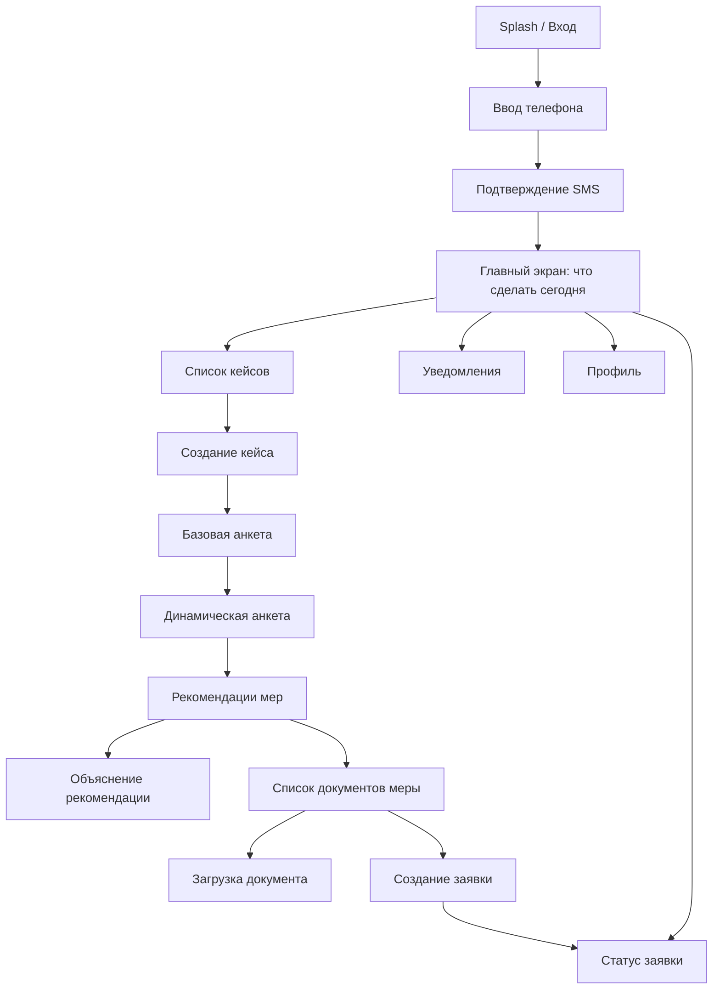
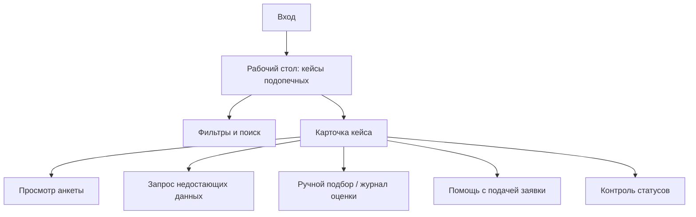
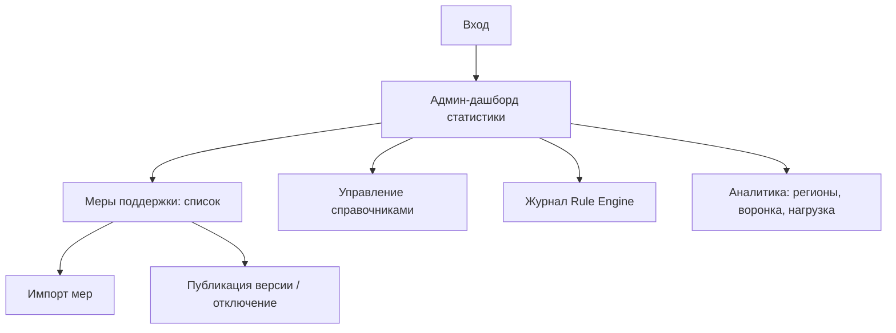

# КУРАТОР — Экранная модель MVP (Screen Map + UI Specification)

**Документ:** MVP_UI_Specification_v1.md
**Версия:** 1.0
**Дата:** 2026-07-06
**Статус:** Draft на приёмку (PM)
**Уровень:** Product + UX Specification — основа для Frontend-разработки без доп. уточнений
**Задача:** T-005
**Зависит от:** MVP_Data_Model_v1.md (v1.1), Rule_Engine_MVP_v1.md, MVP_User_Flows_v1.md, MVP_API_Contracts_v1.md

---

## 0. Назначение

Полная карта экранов MVP и спецификация каждого экрана, чтобы Frontend-команда начала работу
без дополнительных продуктовых уточнений. Каждый экран привязан к endpoints из
MVP_API_Contracts_v1.md. Роли по решению PM: `citizen`, `coordinator`, `admin` (руководитель
свёрнут в admin). Mobile-first, White Label через Design Tokens.

---

## 1. Карта экранов (Screen Map)

### 1.1 Гражданин

### 1.2 Координатор

### 1.3 Администратор

---

## 2. Спецификация экранов

Формат: **Назначение · Ключевые элементы · Действия · Состояния (loading/empty/error) · API.**
Полный перечень 20 экранов MVP.

### Гражданин

**E01. Splash / Вход** — точка входа. Логотип (White Label), кнопка «Войти». → E02.

**E02. Ввод телефона** — поле телефона, чекбокс согласия ПДн, кнопка «Получить код».
Ошибки: неверный формат, лимит. API: `POST /auth/otp/request`.

**E03. Подтверждение SMS** — поле кода (4 цифры), таймер повторной отправки, «Изменить номер».
Ошибки: `invalid_otp`, `otp_expired`. API: `POST /auth/otp/verify`. Успех → E04.

**E04. Главный экран «Что сделать сегодня»** — центральная ценность. Персональный список
действий по срочности (незавершённая анкета, недостающие документы, дедлайны заявок). Пусто:
«Начните с создания кейса». API: `GET /users/me`, `GET /projects`, `GET /notifications`.

**E05. Список кейсов** — карточки кейсов (компонент «карточка кейса»), фильтр по статусу,
кнопка «Новый кейс». API: `GET /projects`.

**E06. Создание кейса** — выбор жизненной ситуации (`life_event`), заголовок. Ошибка:
`duplicate_active_project`. API: `POST /projects`. → E07.

**E07. Базовая анкета** — форма 10–15 вопросов (регион, дата рождения, категории, доход,
дети), прогресс-бар, автосохранение. API: `GET/PUT /projects/{id}/questionnaire`. → E08.

**E08. Динамическая анкета** — вопросы, зависящие от `life_event`. Кнопка «Показать, что
положено». API: `PUT …/questionnaire`, затем `POST …/matching/run`.

**E09. Рекомендации мер** — список результатов, сгруппированных по категории
(eligible / conditional / need_info); карточка меры со Score-индикатором и суммой. Пусто:
«Пока подходящих мер нет» + подписка. API: `GET …/matching/results`.

**E10. Объяснение рекомендации** — Explainability: что выполнено (matched), чего не хватает
(missing), следующий шаг. API: `GET …/matching/results/{measure_id}/explain`.

**E11. Список документов меры** — `required_documents` с отметкой наличия, кнопки «Загрузить».
API: `GET /measures/{id}`, `GET /documents`.

**E12. Загрузка документа** — выбор файла, тип документа, превью. Ошибки: `413`, `415`.
API: `POST /documents` (multipart).

**E13. Создание заявки** — сводка: мера, документы, канал подачи; кнопка «Подать».
Ошибки: `missing_required_documents`, `measure_version_conflict`. API: `POST /applications`,
`POST /applications/{id}/documents`. → E14.

**E14. Статус заявки** — таймлайн статусов (бейдж статуса), суммы, дедлайн, история.
API: `GET /applications/{id}`.

**E15. Профиль** — ФИО, телефон, регион, категории; выход. API: `GET/PATCH /users/me`,
`PUT /users/me/categories`.

**E16. Уведомления** — список внутрисистемных, отметка прочтения. API: `GET /notifications`,
`POST /notifications/{id}/read`.

### Координатор

**E17. Рабочий стол координатора** — таблица кейсов подопечных, сортировка по срочности,
фильтры (статус, life_event, просрочки), счётчики. Действия: открыть кейс, запросить данные.
API: `GET /projects?coordinator=me`, `GET /applications`.

### Администратор

**E18. Журнал Rule Engine** — таблица оценок по кейсу/мере, включая `hidden` с причинами
(`unmet_rules`). Доступ: coordinator (свои), admin. API: `GET …/matching/log`.

**E19. Импорт и управление мерами** — импорт таблицы (Краснодарский край), список мер,
публикация версии, отключение. API: `POST /measures/import`, `POST /measures/{id}/versions`.

**E20. Управление справочниками + Админ-дашборд** — CRUD справочников (`citizen_categories`,
`application_statuses`, `authorities`) и статистика (воронка по этапам, нагрузка,
топ-проблемные шаги, сравнение регионов). API: `GET/PATCH /dictionaries/{name}`,
`GET /dashboard/summary`, `GET /dashboard/regions`, `GET /dashboard/applications`.

---

## 3. Компоненты интерфейса (переиспользуемые)

| Компонент | Назначение | Ключевые пропсы / состояния |
|-----------|-----------|------------------------------|
| Карточка меры поддержки | Показ меры в списке рекомендаций | title, score, category, amount, badge |
| Карточка кейса | Кейс в списке | title, life_event, status, прогресс |
| Индикатор Score | Визуализация 0–100 + категория | value, category (цвет по порогу) |
| Бейдж статуса | Статус заявки/кейса | code, title (из справочника), цвет |
| Прогресс-бар анкеты | Прогресс заполнения | filled/total |
| Поле формы | Универсальный input | type (number/text/date/bool/select), required, error |
| Чек-лист документов | Список required_documents | items, состояние (есть/нет) |
| Таймлайн статусов | История переходов заявки | steps, current |
| Пустое состояние | Empty state | icon, message, CTA |
| Тост/баннер ошибки | Единый вывод ошибок API | error_code → message |

Каждый компонент имеет состояния: `default / loading (skeleton) / empty / error / disabled`.

---

## 4. UX и доступность

- **Mobile-first**, адаптив до desktop.
- **Доступность:** целевой ориентир **WCAG 2.1 AA** — контраст, размеры тапа ≥44px,
  навигация с клавиатуры, ARIA-роли, крупный шрифт (аудитория — в т.ч. пожилые, в стрессе).
- **Минимум обязательных действий** — только критичные поля обязательны, остальное динамически.
- **Единый визуальный язык** для White Label — брендируется через Design Tokens, структура
  экранов неизменна.
- Соответствие UX-целям из User Flows: анкета ≤5 мин, подбор ≤3 сек, объяснение в 1 клик.

---

## 5. Design Tokens (уровень спецификации)

Токены — абстрактные, без привязки к конкретному бренду (условие White Label). Регион задаёт
значения через админку.

| Группа | Токены | Примечание |
|--------|--------|-----------|
| Типографика | `font.family.base`, `font.size.{xs,sm,md,lg,xl,2xl}`, `font.weight.{regular,medium,bold}`, `line.height.{tight,normal}` | Базовый размень 16px, крупные заголовки |
| Отступы | `space.{4,8,12,16,24,32,48}` | Сетка кратна 4px |
| Размеры элементов | `size.tap.min=44`, `radius.{sm,md,lg}`, `control.height.{sm,md,lg}` | Тап ≥44px |
| Сетка | `grid.columns.mobile=4`, `grid.columns.desktop=12`, `grid.gutter` | Адаптивная |
| Состояния кнопок | `button.{default,hover,active,disabled,loading}` | Для primary/secondary/ghost |
| Цветовые роли | `color.brand.primary`, `color.brand.secondary`, `color.bg`, `color.surface`, `color.text.{primary,secondary}`, `color.status.{eligible,conditional,need_info,error,success}` | Роли, не конкретные цвета — White Label |

Категории Score мапятся на `color.status`: eligible→success-зелёный, conditional→жёлтый,
need_info→нейтральный, hidden не показывается.

---

## 6. Связь экранов с API (матрица)

| Экран | Endpoints | События | Права | Ошибки |
|-------|-----------|---------|-------|--------|
| E02/E03 Вход | `/auth/otp/request`, `/auth/otp/verify` | — | public | invalid_otp, otp_expired, rate_limited |
| E04 Главный | `/users/me`, `/projects`, `/notifications` | — | citizen | 401 |
| E06 Создание кейса | `POST /projects` | project.created | citizen | duplicate_active_project |
| E07/E08 Анкета | `GET/PUT …/questionnaire` | questionnaire.updated | citizen | validation_failed |
| E08→E09 Подбор | `POST …/matching/run`, `GET …/results` | matching.completed | citizen | questionnaire_incomplete |
| E10 Объяснение | `GET …/results/{id}/explain` | — | citizen | 404 |
| E12 Загрузка | `POST /documents` | — | citizen | 413, 415 |
| E13 Заявка | `POST /applications`, `POST …/documents` | application.created | citizen/coordinator | missing_required_documents, measure_version_conflict |
| E14 Статус | `GET /applications/{id}` | application.status_changed | owner/coordinator | 403 |
| E17 Раб. стол | `/projects?coordinator=me`, `/applications` | — | coordinator | 403 |
| E18 Журнал RE | `GET …/matching/log` | — | coordinator/admin | 403 |
| E19 Меры | `POST /measures/import`, `…/versions` | — | admin | 403, validation_failed |
| E20 Справочники/дашборд | `/dictionaries/{name}`, `/dashboard/*` | — | admin | 403 |

---

## 7. Проверка критерия готовности (T-005)

| Требование PM | Где выполнено |
|---------------|---------------|
| Карта экранов (Screen Map) для ролей | §1 (Mermaid: гражданин, координатор, админ) |
| Спецификация всех экранов MVP | §2 (20 экранов E01–E20) |
| Переиспользуемые компоненты | §3 |
| UX/доступность | §4 (WCAG 2.1 AA, mobile-first) |
| Design Tokens | §5 |
| Связь каждого экрана с API | §6 (матрица endpoints/события/права/ошибки) |
| Пригодность для старта Frontend | Экран ↔ endpoint ↔ компонент связаны сквозняком |

---

## 8. Вопросы к PM

1. Дизайн-система: берём готовую базу (напр. Material/Ant в нейтральной теме) или собственная
   с нуля на этих токенах?
2. Веб-адаптив мобайл-ферст достаточно для MVP, или уже нужен нативный мобильный клиент?
3. Порядок реализации экранов для спринтов — предложить декомпозицию (следующая задача)?
4. Нужны ли лоу-фай вайрфреймы к спецификации, или текстовой спецификации + токенов достаточно
   для старта Frontend?
