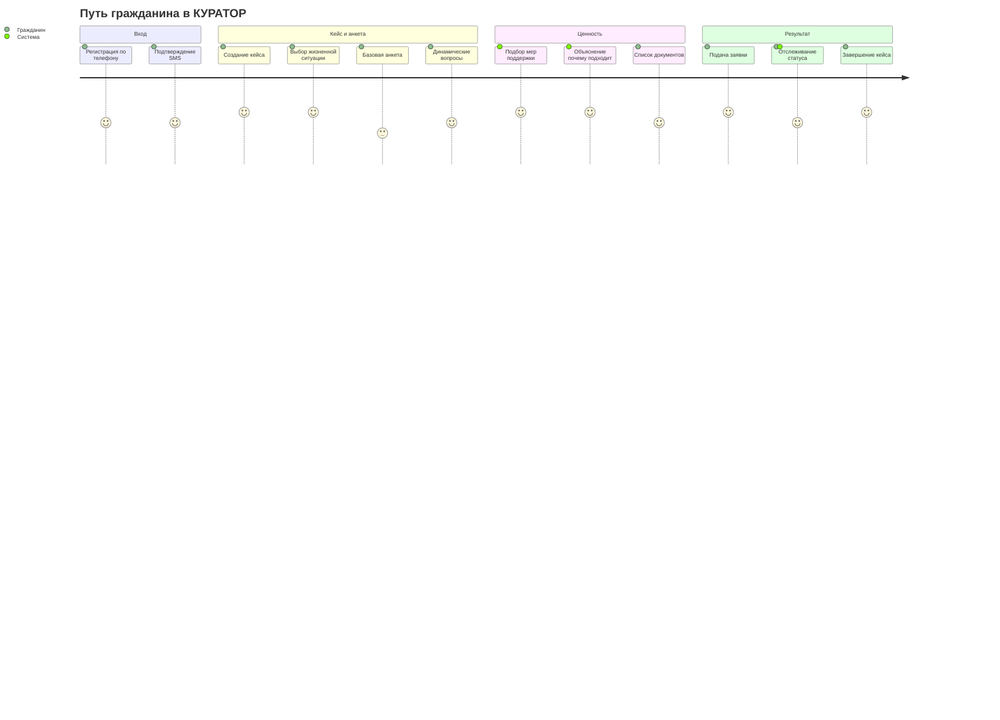
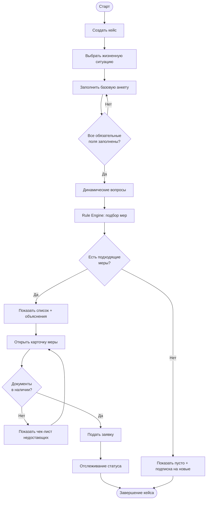
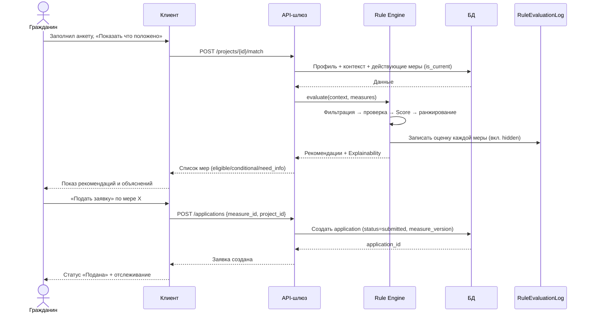

# КУРАТОР — Пользовательские сценарии MVP (User Flows)

**Документ:** MVP_User_Flows_v1.md
**Версия:** 1.0
**Дата:** 2026-07-06
**Статус:** Draft на приёмку (PM)
**Уровень:** Product + UX Architecture — основа для проектирования экранов, REST API и тест-кейсов
**Задача:** T-003
**Зависит от:** MVP_Data_Model_v1.md (v1.1), Rule_Engine_MVP_v1.md (v1.0)

---

## 0. Назначение

Документ описывает полный путь пользователя в «КУРАТОР» — от первого входа до успешной подачи
заявки и завершения кейса. Это связующее звено между архитектурой (модель данных + Rule
Engine) и реализацией (экраны, API-контракты, тест-кейсы).

---

## 1. Карта ролей

| Роль | Цель | Основные действия | Доступные разделы | Ограничения |
|------|------|-------------------|-------------------|-------------|
| **Гражданин** | Узнать, что положено, и получить это | Создать кейс, заполнить анкету, увидеть подбор, подать заявку, отслеживать статус | Мои кейсы, анкета, рекомендации, заявки, документы, уведомления | Видит только свои данные; не редактирует меры; не видит журнал Rule Engine |
| **Координатор** | Сопровождать закреплённых граждан | Просмотр кейсов, проверка анкет, запрос данных, ручной подбор, помощь с подачей, контроль статусов | Рабочий стол, кейсы подопечных, заявки, журнал оценки (по кейсу) | Видит только закреплённых граждан; не управляет справочниками |
| **Руководитель** | Видеть эффективность и нагрузку | Просмотр дашборда, метрик, распределения по этапам, нагрузки координаторов | Дашборд, отчёты, сравнение подразделений | Только чтение агрегатов; не видит ПДн в деталях |
| **Администратор** | Наполнять и настраивать платформу | Загрузка/версионирование мер, управление справочниками, White Label, просмотр журналов | Меры, справочники, регионы, журналы, настройки | В рамках своей организации/региона |

Права наследуют RBAC из архитектуры: `citizen < coordinator < manager < admin`. 2FA
обязательна для `coordinator` и выше.

---

## 2. Основной сценарий гражданина

Полный путь. Для каждого шага: **вход → действие пользователя → действие системы → ошибки →
результат.**

| # | Шаг | Вход | Действие пользователя | Действие системы | Ошибки | Результат |
|---|-----|------|----------------------|------------------|--------|-----------|
| 1 | Регистрация | Телефон | Ввод телефона, согласие на ПДн | Отправка SMS-кода, создание `user(role=citizen, status=invited)` | Неверный номер; SMS не дошёл (повтор) | Учётка создана |
| 2 | Авторизация | SMS-код | Ввод кода | Проверка кода, выдача JWT, `status=active` | Неверный/просроченный код | Вход выполнен |
| 3 | Создание кейса | — | Кнопка «Новый кейс» | Создание `project(status=draft)` | — | Черновик кейса |
| 4 | Выбор жизненной ситуации | Список `life_event` | Выбор («СВО», «инвалидность», «рождение ребёнка»…) | Запись `project.life_event`, выбор ветки анкеты | Не выбрано | Ветка анкеты определена |
| 5 | Базовая анкета | Форма 10–15 вопросов | Ответы (регион, дата рождения, категории, доход, дети) | Валидация, запись в профиль/контекст, `user_category` | Пропущено обязательное поле | Базовый профиль собран |
| 6 | Динамические вопросы | Вопросы под `life_event` | Ответы на уточнения | Дозаполнение Evaluation Context | — | Контекст полон |
| 7 | Подбор мер | Контекст | Кнопка «Показать, что положено» | Rule Engine: фильтрация → проверка → Score → ранжирование; запись `RuleEvaluationLog` | Меры не найдены (см. §5) | Список рекомендаций |
| 8 | Просмотр объяснений | Результат подбора | Клик «Почему подходит» | Показ Explainability (matched / missing / next_step) | — | Понятно, что и почему |
| 9 | Список документов | Мера | Открытие карточки меры | Показ `required_documents`, отметка имеющихся | — | Чек-лист документов |
| 10 | Подача заявки | Мера + документы | Кнопка «Подать заявку» | Создание `application(status=submitted)`, фиксация `measure_version` | Нет обязательных документов (см. §5) | Заявка подана |
| 11 | Отслеживание статуса | Заявка | Просмотр статуса | Обновление `application_status`, уведомления | — | Прозрачность хода |
| 12 | Завершение кейса | Все заявки закрыты | — | `project.status=completed`, `closed_at` | — | Кейс завершён |

---

## 3. Сценарий координатора

Полный цикл сопровождения закреплённых граждан:

1. **Новые кейсы** — на рабочем столе список кейсов подопечных, отсортированных по срочности
   (просроченные дедлайны сверху).
2. **Фильтрация** — по статусу, жизненной ситуации, этапу, наличию просрочек.
3. **Проверка анкеты** — открытие кейса, просмотр ответов гражданина и собранного контекста.
4. **Запрос недостающих данных** — если статус меры `need_info`, отправка гражданину запроса
   (уведомление + список полей из `missing_fields`).
5. **Ручной подбор** — при спорных случаях координатор смотрит `RuleEvaluationLog` (в т.ч.
   скрытые меры) и может вручную предложить меру.
6. **Помощь с подачей** — проверка документов (`document.status=verified`), помощь в
   оформлении заявки.
7. **Контроль статусов** — отслеживание всех заявок подопечных, реакция на отказы и дедлайны.
8. **Завершение сопровождения** — закрытие кейса, отметка результата.

---

## 4. Административные сценарии

| Процесс | Шаги | Результат |
|---------|------|-----------|
| Загрузка новых мер | Импорт (напр. таблица льгот Краснодарского края) → маппинг полей → заполнение `eligibility` | Новые `support_measure(version=1, is_current=true)` |
| Публикация новой версии | Правка меры → создаётся `version+1`, старая `is_current=false`, `valid_to` | История сохранена, действует новая |
| Отключение меры | Установка `valid_to` / снятие `is_current` | Мера не участвует в подборе |
| Управление справочниками | Правка `citizen_category`, `application_status`, `authority`, `region` | White Label без кода |
| Просмотр журналов Rule Engine | Открытие `RuleEvaluationLog` по кейсу/мере | Разбор спорных отказов, аудит |
| Просмотр статистики | Дашборд: воронка по этапам, топ-проблемные шаги, нагрузка | Управленческие решения |

---

## 5. Альтернативные и ошибочные сценарии

| Ситуация | Поведение системы | Что видит пользователь |
|----------|-------------------|------------------------|
| Мера не найдена | Пустой результат подбора | «Пока подходящих мер нет. Мы уведомим, когда появятся» + предложение проверить данные |
| Анкета не завершена | Кейс остаётся `draft`, автосохранение | Возможность вернуться и продолжить; напоминание |
| Нет обязательных документов | Заявка не отправляется | Чек-лист недостающих документов + подсказка, где получить |
| Мера стала недоступной после смены версии | Заявка хранит `measure_version` на момент подачи | Уже поданная заявка обрабатывается по старой версии; новый подбор её не предлагает |
| Отказ по заявке | `application_status=rejected` (terminal), запись причины | Причина отказа + возможность повторной подачи |
| Повторная подача | Создаётся новая `application`, ссылка на предыдущую | История сохранена |

---

## 6. Диаграммы

### 6.1 User Journey (гражданин)

### 6.2 Activity Diagram (создание кейса → подача заявки)

### 6.3 Sequence Diagram (подбор меры и подача заявки)

---

## 7. Нефункциональные требования к UX

| Показатель | Цель | Обоснование |
|------------|------|-------------|
| Заполнение базовой анкеты | ≤ 5 минут | Конверсия; не отпугнуть на входе |
| Время подбора мер | ≤ 3 секунды | Ощущение мгновенного ответа |
| Доступ к объяснению | в 1 клик | Доверие — ключевая ценность продукта |
| Кол-во экранов до ценности | минимально | Гражданин должен быстро увидеть «что положено» |
| Обязательные поля | только критичные | Остальное — динамически по мере необходимости |
| Доступность | простой язык, крупный шрифт, мобильный first | Аудитория — в т.ч. пожилые и в стрессе |

---

## 8. Проверка критерия готовности (T-003)

| Требование PM | Где выполнено |
|---------------|---------------|
| Описаны все роли MVP | §1 (гражданин, координатор, руководитель, администратор) |
| Полный жизненный цикл кейса | §2 (12 шагов регистрация → завершение) |
| Альтернативные и ошибочные сценарии | §5 (6 ситуаций) |
| Диаграммы Mermaid | §6 (Journey, Activity, Sequence) |
| Пригодность как основа для экранов, REST API, тест-кейсов | §2 (таблица вход/действие/ошибки), §6.3 (эндпоинты /match, /applications) |

---

## 9. Вопросы к PM

1. Регистрация — только по телефону+SMS, или сразу закладываем вход через Госуслуги (ЕСИА)?
2. Может ли гражданин подать заявку сам полностью без координатора, или на этапе MVP подача
   всегда проходит через проверку координатором?
3. Руководитель и администратор — это две отдельные роли или на MVP совмещаются в одной?
4. Нужны ли уже в MVP push/SMS-уведомления, или достаточно уведомлений внутри интерфейса?
